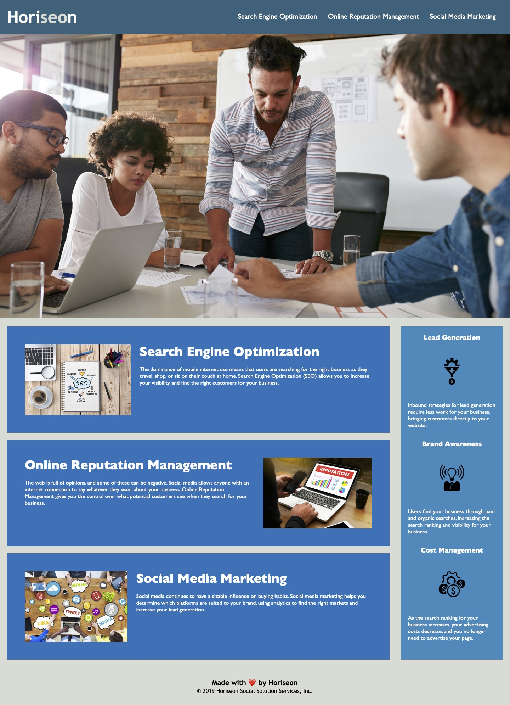

# horiseon-accessibility-optimzation

## Description

This project is aimmed to improve the accessibility of the Horiseon company site to ahere with the accessibility standards and optimize the site for search engine. The project updated the generic HTML semantics in .html file and replaced with meanful ones. The project also refreshed .css to reflect the change in .html.

## Screenshot

## Link to deployed application

https://ywkuo227.github.io/horiseon-accessibility-optimzation/
